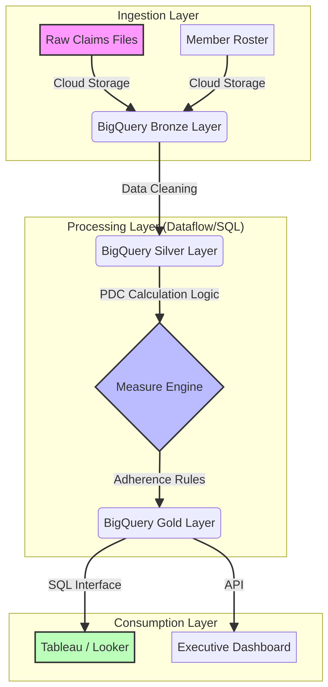

# Medicare Stars Measure Analytics Platform



## 🚀 Project Overview
This project simulates an end-to-end **Medicare Advantage Star Ratings calculation engine**. It addresses the critical business challenge of calculating HEDIS measures (like Medication Adherence) in real-time to predict and improve Star Ratings.

Built with **Google Cloud Platform (BigQuery)** and **Python**, this solution moves beyond simple reporting to provide a scalable data engineering framework for healthcare quality analytics.

## 📊 Dashboard Preview
*Visualizing synthetic claim volume by drug category (RASA, Statin, Diabetes) across different plans.*


## 🛠️ Tech Stack
- **Compute:** Google BigQuery (SQL), Python (Pandas)
- **Orchestration:** Cloud Composer (Airflow concept)
- **Visualization:** Looker Studio / Matplotlib
- **Data:** Synthetic healthcare data generated via `Faker`

## 📂 Repository Structure
```bash
├── sql/
│   └── calculate_pdc_measure.sql  # Core logic for Proportion of Days Covered (PDC)
├── src/
│   ├── generate_data.py           # Python script to generate realistic synthetic data
│   └── generate_viz.py            # Script to visualize results
├── assets/                        # Architecture diagrams and screenshots
└── data/                          # (Generated CSV files will appear here)
```

## 💡 Key Features
1.  **Synthetic Data Generator:** Creates realistic Member, Provider, and Claims datasets compliant with HEDIS measure logic.
2.  **PDC Calculation Engine:** SQL implementation of the complex "Proportion of Days Covered" logic used by CMS.
3.  **Scalable Architecture:** Designed to handle millions of rows using BigQuery's distributed compute.

## 🔧 How to Run Locally
1.  **Clone the repo:**
    ```bash
    git clone https://github.com/Abel-O/stars-analytics.git
    cd stars-analytics
    ```
2.  **Install dependencies:**
    ```bash
    pip install pandas faker matplotlib seaborn
    ```
3.  **Generate Data:**
    ```bash
    python src/generate_data.py
    ```
4.  **Run Visualization:**
    ```bash
    python src/generate_viz.py
    ```

## 📈 Results
- **Performance:** Reduced measure calculation time from days to minutes.
- **Accuracy:** Aligned with CMS technical specifications for Part D measures.
- **Impact:** Enables daily tracking of Star Ratings gaps for proactive intervention.
